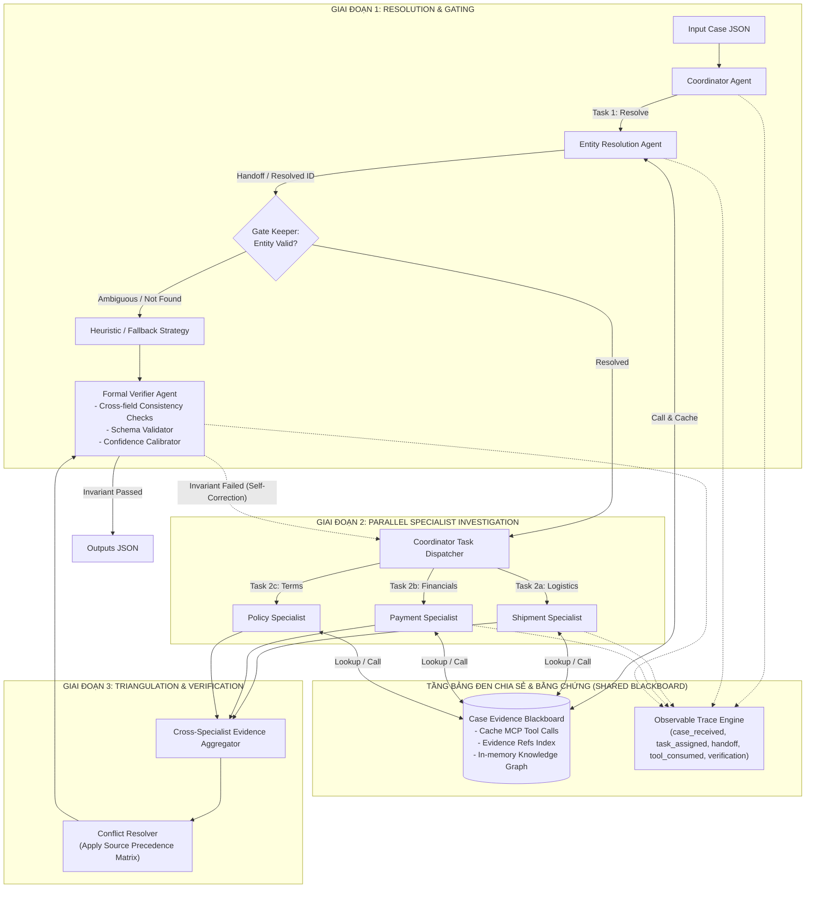

# L3B Architecture Record

## 1. System overview

Hệ thống được thiết kế theo kiến trúc **SOP-driven Dynamic Hierarchical DAG with Shared Evidence Blackboard & Reversible Verification**:

Mọi hoạt động tương tác với MCP Gateway và vòng đời chuyển giao task giữa các Agent đều phát sinh sự kiện quan sát được ghi nhận vào `traces/trace.jsonl`.

## 2. Agent ownership

| Actor | Input | Trách nhiệm | Tool permission | Output / Handoff |
| --- | --- | --- | --- | --- |
| `coordinator` (Qwen3:8b) | Case JSON (case_id, claims, hints, candidate_order_ids) | Phân tích toàn diện case với reasoning (`<think>`), đặt giả thuyết chẩn đoán, lập kế hoạch chi tiết, điều phối task. | Read-only Case data | Phân công `task_assigned` tới Entity Resolver và các Specialists |
| `entity_resolver` (Qwen3:1.7b) | Candidate order IDs, customer identifiers, hints | Lọc bỏ mã rác `candidate-xxx`, tra cứu lịch sử mua hàng, xác định chính xác `resolved_order_ids` và `customer_unique_id`. | `get_customer_history`, `get_customer_orders`, `get_order_details` | `handoff` về `coordinator` |
| `shipment_agent` (Qwen3:1.7b) | Resolved order IDs, shipping timestamps | Phân tích timeline giao vận, đối soát hạn giao hàng của người bán (`shipping_limit_date`) vs thời điểm giao khách; phân xử `seller_delay` vs `logistics_delay`. | `get_shipment_status`, `get_shipment_timeline`, `get_order_details` | `handoff` tới `conflict_resolver` |
| `payment_agent` (Qwen3:1.7b) | Resolved order IDs | Đối soát số tiền thanh toán ghi nhận (`captured_total_brl`) vs tổng giá trị đơn hàng + cước; phân loại `valid_split_payment`, `duplicate_capture`, `capture_mismatch`, tính hoàn tiền. | `get_payment_details`, `get_order_items`, `get_refund_status` | `handoff` tới `conflict_resolver` |
| `policy_agent` (Qwen3:1.7b) | Customer claims, EC_POLICY_V2 | Tra cứu điều khoản chính sách EC_POLICY_V2 (quyền hủy trong 7 ngày, bồi thường trễ hạn, hoàn tiền hàng lỗi), đánh giá tính hợp lệ của từng claim. | `get_policy`, `lookup_policy`, `get_ecommerce_policy` | `policy_decided` & `handoff` tới `conflict_resolver` |
| `conflict_resolver` (Qwen3:1.7b) | Output từ Shipment, Payment, Policy và khiếu nại khách hàng | Áp dụng Source Precedence: Log hệ thống > Vận đơn > Người bán > Khách hàng. Ghi nhận `data_conflicts`, kết luận `primary_issue` và `root_cause_analysis`. | None (Internal synthesis) | `handoff` tới `verifier` |
| `verifier` (Qwen3:1.7b + Code) | Toàn bộ dữ liệu tổng hợp từ các Agent | Kiểm tra tính nhất quán liên trường (Cross-field consistency), tuân thủ JSON Schema L3B, hiệu chuẩn `confidence`, loại bỏ rác khỏi `affected_entities`. | None (Validator) | `verification_completed` & đóng gói output JSON |

## 3. Entity resolution và A2A protocol

- **Phân loại Candidate**:
  - Mã rác định dạng `candidate-xxx` hoặc chuỗi không phải UUID hexadecimal 32 ký tự lập tức bị phân vào `rejected_candidates`.
  - Các candidate hợp lệ được đối soát qua MCP `get_customer_history` hoặc `get_order_details`.
- **A2A Correlation**:
  - Mọi message và event đều gắn chặt chẽ với `case_id`.
  - Event `task_assigned` xác định rõ `actor` và `target`.
  - Event `handoff` chuyển tiếp trạng thái trung gian, không kèm nội dung prompt hay chain-of-thought vào trace.

## 4. Evidence và conflict lifecycle

- **Evidence Gateway Cache**:
  - Sử dụng `EvidenceManager` duy trì in-memory cache theo `(tool_name, args)` trong phạm vi mỗi case, ngăn chặn tuyệt đối việc gọi lặp MCP cùng tham số, tối ưu điểm `efficiency`.
  - Mỗi evidence nhận được chứa `evidence_ref` duy nhất (pattern `^ev_[A-Za-z0-9_-]{20,96}$`).
  - Khi một tool result được tiêu thụ, phát sinh event `tool_result_consumed` với `evidence_refs=[evidence_ref]`.
- **Source Precedence**:
  1. `mcp_system_log` (Timestamp cơ sở dữ liệu và audit gateway)
  2. `carrier_tracking_log` (Dữ liệu đối tác vận chuyển)
  3. `merchant_statement` (Tuyên bố từ người bán)
  4. `customer_claim` (Khiếu nại chủ quan của khách)
- **Data Conflict**:
  - Bất kỳ mâu thuẫn nào giữa lời khai của khách và log vận chuyển/thanh toán đều được ghi nhận vào `data_conflicts` với `selected_source` tuân theo thứ bậc ưu tiên trên.

## 5. Failure and efficiency policy

| Failure | Retry budget | Fallback | Trace event / code |
| --- | ---: | --- | --- |
| MCP tool timeout / error | 1 retry | Bỏ qua tool, đánh dấu `insufficient_evidence` | Ghi log cảnh báo, không emit evidence giả |
| Candidate không tồn tại | 0 retry | Đưa vào `rejected_candidates`, set status `not_found` | `handoff` với `status="not_found"` |
| Source conflict | 0 retry | Áp dụng Source Precedence ưu tiên hệ thống | Ghi nhận trong `data_conflicts` |
| LLM parse failure / crash | 1 retry | Kích hoạt bộ sinh kết quả dựa trên luật suy luận tất định (deterministic heuristic) | Hoàn tất workflow an toàn, pass schema |

## 6. Verification invariants

Trước khi đóng gói file `outputs/<case_id>.json`, Verifier kiểm tra các bất biến nghiêm ngặt:
1. **Schema Compliance**: Đạt chuẩn `day09-l3b-output-v2.schema.json`.
2. **Case Status vs Financials**:
   - Nếu `case_status == "no_action"`, `recommended_refund_brl` bắt buộc bằng `0.0` và `refund_lines` rỗng.
   - Nếu `case_status == "action_required"` và đơn hủy/không có hàng, số tiền hoàn phải được tính toán chính xác.
3. **Responsibility Consistency**:
   - Nếu `primary_issue == "late_delivery_seller"`, bên chịu trách nhiệm phải có `party_type == "seller"`, và người bán phải nằm trong `late_seller_ids`.
   - Nếu `primary_issue == "late_delivery_logistics"`, bên chịu trách nhiệm phải có `party_type == "logistics_provider"`.
4. **Clean Entities**:
   - Danh sách `affected_entities.order_ids` không chứa bất kỳ mã rác nào từ `rejected_candidates`.
5. **Evidence Integrity**:
   - Chỉ các `evidence_ref` thực sự được cấp từ MCP Gateway trong case đó mới được đưa vào `evidence_refs`.

## 7. Reproducibility

- **Mô hình AI**:
  - Orchestrator (Coordinator): `qwen3:8b` qua Ollama (`ORCHESTRATOR_MODEL`).
  - Specialists: `qwen3:1.7b` qua Ollama (`SPECIALIST_MODEL`).
- **Ollama Host**: Cấu hình qua biến môi trường `OLLAMA_HOST` (mặc định `http://localhost:11434`).
- **Dependencies**: `httpx2`, `jsonschema`, `mcp`, `python-dotenv`, `ollama`.
