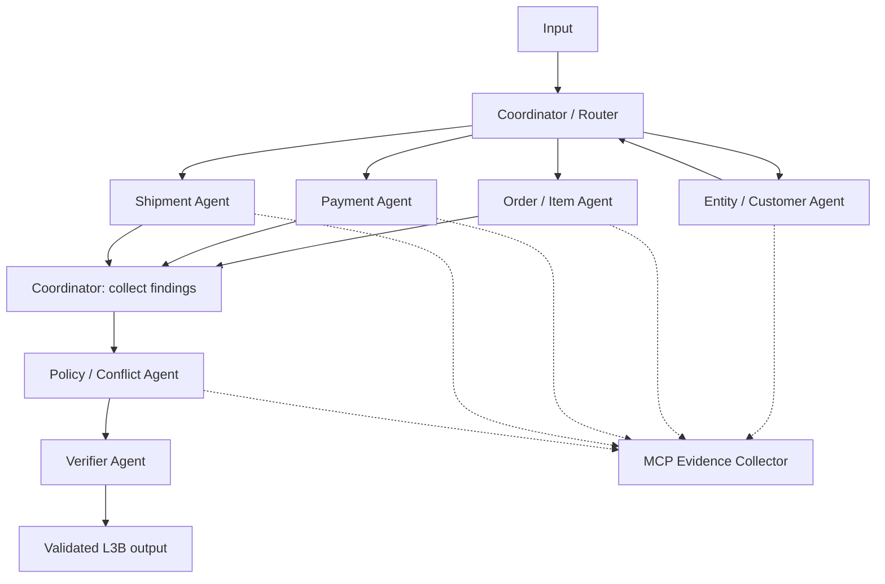

# L3B Architecture Record

## 1. Phạm vi pha 2

Chọn Python async state-machine, không thêm framework. Tài liệu này chốt thiết
kế để triển khai; solve_case() vẫn là starter, chưa thực thi nghiệp vụ.



Collector quản lý evidence, không tự kết luận. Mỗi case có state, cache,
evidence registry và call counter riêng. CLI chạy case tuần tự; tối đa 3
specialist đồng thời sau entity resolution. Policy chờ findings, verifier
kiểm chứng cuối. Không chạy điều tra trên candidate chưa được xác nhận.

## 2. Agent ownership và tool permissions

| Actor | Input | Trách nhiệm | Tool được phép | Handoff |
| --- | --- | --- | --- | --- |
| coordinator | Case và findings | Route, budget, tổng hợp draft | Không gọi evidence tool trực tiếp | Task cho agents, draft cho verifier |
| entity-agent | Identifiers, candidates, complaint | Resolve/reject candidate, customer context | get_customer_history, get_order | Entity scope cho coordinator |
| order-agent | Entity scope | Order, item, product, seller | get_order, get_order_items, get_product_context, get_sellers | Findings và refs |
| payment-agent | Entity scope | Capture, split payment, duplicate, refund | get_order_payments, get_payment_timeline, get_refund_timeline | Payment analysis và refs |
| shipment-agent | Entity scope | Timeline, seller/logistics delay | get_shipment_summary, get_order_items | Shipment analysis và refs |
| policy-agent | Findings, conflicts | Source precedence, trách nhiệm, đề xuất xử lý | get_policy | Assessment, conflicts, financial resolution |
| verifier | Draft, registry, findings | Schema và semantic invariants | Không gọi MCP | Validated output hoặc lỗi |

Collector kiểm tra allowlist trước cả cache lookup. Runtime phải discovery
và chỉ dùng giao của allowlist với tool hiện có. Đọc inputSchema của tool
trước khi lập arguments; list_tools() hiện chỉ trả tên, cần bổ sung metadata
ở pha triển khai. Không đoán tool hoặc arguments khi thiếu metadata.

## 3. Entity resolution và A2A protocol

A2A là message nội bộ cùng process, không tuyên bố hỗ trợ giao thức A2A HTTP.
Envelope nội bộ được chốt như sau:

| Field | Ràng buộc |
| --- | --- |
| message_id | Duy nhất trong run, chống nhận lặp |
| case_id | Bắt buộc trùng state của recipient |
| sender, recipient | Actor trong bảng ownership |
| task_type | resolve_entity, investigate_order, investigate_payment, investigate_shipment, apply_policy, verify |
| status | assigned, completed, failed |
| entity_scope | IDs đã xác nhận; candidate chỉ dùng ở bước resolve |
| evidence_refs | Refs trong registry case hiện tại |
| payload | Dữ liệu task/finding có cấu trúc, chỉ lưu nội bộ |
| error_code | null khi thành công, mã lỗi khi thất bại |

Không đưa envelope vào output, MCP response hoặc manifest. Trace chỉ map các
field được schema cho phép; message_id/task_type có thể nằm trong attributes
kiểu scalar. Không trace payload, prompt, chain-of-thought, API key/raw response.

Resolver xét candidates từ input và dữ liệu liên quan do MCP trả về; không
quét toàn bộ khách hàng. Exact order ID vẫn phải kiểm tra bằng evidence.
Xếp hạng theo identifier, customer và thời gian/item/amount khi có dữ liệu;
mâu thuẫn identifier cứng loại candidate. Không resolve chỉ vì mô tả gần giống.
Ngưỡng thiết kế ban đầu: confidence >= 0.90, chênh candidate thứ hai >= 0.15,
không có mâu thuẫn cứng. Công thức score phải xác định từ input/evidence thật
ở pha triển khai; score chưa phải xác suất đã calibration. Tie/thiếu evidence
trả ambiguous; không có candidate phù hợp trả not_found. Case nhiều đơn thì
resolve từng đơn, không ép chỉ chọn một đơn cho cả case.

Coordinator phát task_assigned khi giao việc; agent phát handoff khi bàn giao
kết quả thực tế. Recipient kiểm tra case, actor, task, refs trước khi nhận.
Deadline mỗi task 120 giây, mỗi case 600 giây. Hết hạn hủy và chờ task con
kết thúc. Không handoff vòng tròn; verifier chỉ yêu cầu sửa draft một lần từ
evidence hiện có, sau đó thành công hoặc dừng case.

## 4. Public contracts và evidence lifecycle

Giữ nguyên toàn bộ contracts/schemas/, kể cả L3A vì L3B tham chiếu $defs L3A.
contracts/schema-lock.json lưu SHA-256 của JSON chuẩn hóa, pytest kiểm tra
inventory và digest. Lock bảo vệ baseline repo hiện tại, không phải chữ ký
xác thực của bên phát hành. Chỉ cập nhật khi tiếp nhận release chính thức;
không sửa schema/lock để hợp thức hóa output sai. Whitespace/newline không
ảnh hưởng digest.

| Boundary | Schema | Cổng kiểm tra hiện có |
| --- | --- | --- |
| MCP response | mcp-evidence-response-v1.schema.json | EvidenceGateway.call |
| Trace | trace-event-v1.schema.json | TraceWriter.emit |
| Output | l3b-output-v2.schema.json và L3A refs | CLI sau solve_case, submission validator |
| Manifest | submission-manifest-v2.schema.json | Submission builder/validator |

Không thêm field tại object cấm additionalProperties. Vùng mở như MCP data
và trace attributes tuân theo schema; không tự sửa public contract cho nội bộ.
Unknown chỉ dùng null/enum thiếu evidence tại nơi schema cho phép.

Collector nhận envelope đã validate, giữ nguyên evidence_ref, result_hash,
domain, data và warnings. Registry gắn ref với run nội bộ, case, tool, arguments.
Envelope không có team/run/case nên schema validation không chứng minh ownership;
server audit là nơi kiểm chứng cuối. Không tự tính lại result_hash khi chưa
biết thuật toán chuẩn hóa server. Không tái sử dụng refs giữa case hoặc run.

Agent thực sự dùng evidence phải emit tool_result_consumed với actor/tool/refs,
kể cả cache hit. Claim-to-evidence map lưu nội bộ; claim_assessments nếu xuất
phải đúng schema. Output chỉ chứa refs liên quan, tối đa 30; mỗi trace event
tối đa 20 refs, chia nhiều event nếu cần.

Policy chọn nguồn theo policy MCP, không tự mặc định nguồn mới nhất luôn đúng.
Conflict ghi field, sources, selected_source, resolution_code. Nếu chưa giải
quyết thì selected_source=null; không kết luận chắc chắn dựa trên field đó.
Tên nguồn lấy từ evidence có thật.

## 5. Failure và efficiency policy

Các mức dưới đây là cấu hình thiết kế đội, không phải budget bí mật của scorer.
Tối đa 20 evidence calls/case, gồm retry; cảnh báo nội bộ ở 12. Timeout mỗi
call 30 giây. Cache key: case_id + tool + arguments chuẩn hóa. Chỉ cache response
hợp lệ thành công; request trùng đang chạy dùng chung task. Kiểm tra budget
và tăng counter trước dispatch phải đồng bộ để không vượt giới hạn khi chạy
3 specialist. Không cache exception hoặc cache chéo case/run.

| Failure | Retry budget | Fallback | Trace event / decision_code |
| --- | --- | --- | --- |
| Timeout/transport tạm thời | 1 retry, backoff 1 giây, chỉ tool đọc idempotent | Finding thiếu evidence nếu biểu diễn trung thực được | handoff / MCP_UNAVAILABLE |
| Auth, arguments, envelope sai schema | 0 | Dừng case, không tạo kết quả giả | handoff / MCP_CONTRACT_ERROR |
| Entity ambiguous/not found | Không lặp query giống nhau | Giữ unresolved, chặn kết luận tài chính theo candidate | handoff / ENTITY_UNRESOLVED |
| Source conflict | Query bổ sung có mục tiêu trong budget | Giữ unresolved conflict | policy_decided / CONFLICT_UNRESOLVED |
| Invalid specialist result | Sửa nội bộ 1 lần, không tự gọi lại MCP | Dừng nếu vẫn sai | handoff / INVALID_RESULT |
| Hết budget/deadline | 0 | Chỉ dùng evidence hiện có nếu đủ điều kiện | handoff / BUDGET_EXHAUSTED hoặc DEADLINE_EXCEEDED |
| Verifier không đạt | Sửa draft 1 lần | Dừng, không finalize nếu vẫn sai | handoff / VERIFICATION_FAILED |

Không thêm event_type retry/error vì schema cấm. Các decision_code trên gắn
với bàn giao/quyết định thực tế. needs_investigation không đảm bảo có điểm:
thiếu required evidence vẫn có thể bị hard gate. Không giả câu trả lời để pass.

## 6. Verification invariants

- Đúng L3B schema/version/case_id; không field lạ, enum sai hoặc NaN.
- Resolved IDs không giao rejected candidates; affected entities thuộc scope
  đã kiểm chứng. Related orders không tự động là affected orders.
- Refs tồn tại trong registry case hiện tại, có trace consumed và hỗ trợ claim.
- Timeline phù hợp shipment verdict; seller chịu trách nhiệm phải liên quan
  đến order/item có evidence chậm tương ứng.
- Tính BRL bằng Decimal nội bộ; tổng refund_lines bằng recommended_refund_brl;
  đề xuất không vượt số còn có thể hoàn đã kiểm chứng, không hoàn trùng khoản
  đã hoàn. Thiếu số tiền không đồng nghĩa số tiền đã xác nhận bằng 0.
- selected_source thuộc sources hoặc null. Conflict chưa giải quyết phản ánh
  vào status/action/confidence. Confidence trong [0,1], phù hợp evidence.
- Issue, responsibility, financial resolution và actions nhất quán; không
  lặp action/rank nguyên nhân.

CLI đã phát case_received trước solve_case và case_finalized sau validate/ghi
output. Workflow không phát trùng hai sự kiện này. Verifier chỉ emit
verification_completed sau khi kiểm chứng thực tế thành công.

## 7. Reproducibility và tiêu chí hoàn tất

Python >=3.11; dependencies hiện có trong pyproject.toml. Pha 2 chưa chọn LLM,
không cần random seed. Event ID/timestamp có thể khác giữa run. Khi thêm model
phải ghi model ID, temperature, prompt version, timeout và seed nếu hỗ trợ.
Dependency ranges hiện chưa là lock chính xác; trước chạy nộp bài lưu phiên
bản môi trường thực tế để tái lập, không ghi secrets. Concurrency/budget/deadline
là các giá trị thiết kế ở trên, cần được enforce ở pha triển khai.

Kiểm tra pha 2 tại root repo:

```text
python -m pytest -q
python -m ruff check .
```

Sau khi triển khai solve_case:

```text
day09 validate-inputs
day09 mcp-tools
day09 run
day09 validate
day09 package --output dist/submission.zip
```

Pha 2 hoàn tất khi thiết kế ownership/handoff/retry đã chốt và contract lock
qua kiểm tra. Runtime A2A, permission enforcement, cache/budget, semantic
verifier và specialist nghiệp vụ thuộc pha triển khai tiếp theo. ZIP nộp chỉ
chứa manifest.json, trace.jsonl, outputs/<case_id>.json theo README.
